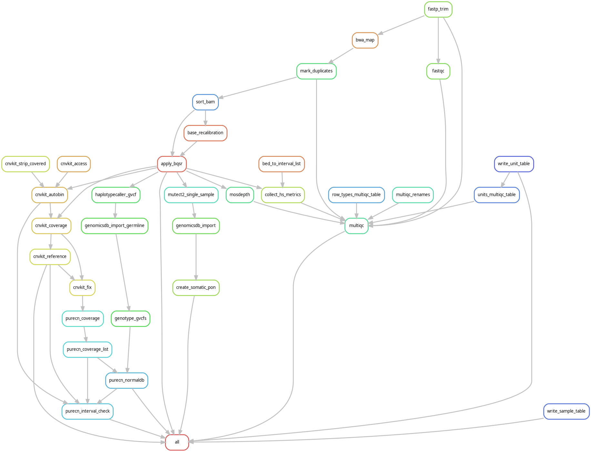

# WES-PON-smk

[](https://github.com/dmkv1/WES-PON-smk/blob/development/CHANGELOG.md)
[](https://github.com/dmkv1/WES-PON-smk/actions/workflows/tests.yml)


A Snakemake pipeline that builds **Panels of Normals (PON)** for tumor-only
[Whole Exome Sequencing (WES) analysis](https://github.com/dmkv1/WES-snakemake). Tumor-only calling needs a PON to remove
recurrent germline and artifact signal. From a set of normal samples this
pipeline builds four deliverables:

| deliverable | path under `results/PON/` | grouped by |
|---|---|---|
| Mutect2 somatic PON | `mutect2/{probes}/pon.vcf.gz` | kit |
| CNVkit bin definitions | `cnvkit/{probes}/targets.bed`, `antitargets.bed` | kit |
| CNVkit reference profile | `cnvkit/{probes}/reference_{sex}.cnn` | kit x sex |
| PureCN normal database and mapping bias | `purecn/{probes}/normalDB_*.rds`, `mapping_bias_*.rds` | kit x sex |

The pipeline also aligns and recalibrates each normal, and writes a MultiQC
report.

## Workflow



Each normal goes through FASTQ trim, alignment, duplicate marking and BQSR.
Three arms then start from the recalibrated BAM:

- **Somatic.** Mutect2 in tumor-only mode gives one VCF per normal.
  GenomicsDBImport collects them per kit. CreateSomaticPanelOfNormals makes
  `pon.vcf.gz`.
- **CNV.** `cnvkit.py access` and `autobin` define the bins per kit.
  `cnvkit.py coverage` measures each normal. `cnvkit.py reference` pools the
  normals of one sex into `reference_{sex}.cnn`. `cnvkit.py fix` then puts each
  normal through the same correction that the tumors get downstream, and writes
  its `.cnr`.
- **Germline.** HaplotypeCaller writes one GVCF per normal. GenomicsDBImport and
  GenotypeGVCFs make a joint VCF per kit. PureCN reads that VCF to model the
  mapping bias.

PureCN NormalDB is built from the `.cnr` files, not from the raw coverage. The
tumors are corrected against the same reference, so only the `.cnr` bin set
matches what PureCN sees at call time.

The `interval_check_{sex}.ok` gate closes the CNV and purity arm. It asserts
that the targets, the antitargets, the CNVkit reference and every coverage file
of a NormalDB hold canonical contigs only, and that all normals of one NormalDB
share one interval set. `createNormalDatabase()` needs that second condition
internally. Without the gate a small divergence, such as six ALT-contig bins,
can reach production and make PureCN reject every tumor.

### Why the two grouping levels

The Mutect2 PON and the CNVkit bin definitions are pooled per kit. Sex has no
effect on either.

The CNVkit reference and the PureCN NormalDB are pooled per kit **and** sex.
`cnvkit.py fix` masks chrX and chrY bins differently for a male and a female
reference, so the two sexes never share one bin set. PureCN then refuses a
NormalDB whose members have different intervals.

Only the kit and sex combinations that occur in the sample sheet are built.

## Requirements

- Linux with **Singularity/Apptainer** (GATK, CNVkit and PureCN run from pinned
  containers) and **conda** (fastp, bwa, samtools, mosdepth, fastqc, multiqc run
  from conda envs).
- Reference genome and resource files (see below) on local disk.

The GATK 4.6.2.0, CNVkit 0.9.14 and PureCN 2.10.0 images are pulled
automatically. Tool versions for the conda steps are pinned in `workflow/envs/`.

## Setup

### 1. Create the runner environment

```bash
conda env create -f environment.yml   # creates env "snakemake" (snakemake>=8.29.3, pandas)
conda activate snakemake
```

### 2. Provide reference files

`config.yaml` holds the run settings. The repository tracks `config.yaml.example`
and ignores `config.yaml`, so your host paths stay out of git. Copy the example
first:

```bash
cp config.yaml.example config.yaml
```

Then repoint every `/path/to/...` placeholder. Under `refs`:

- `path` - the root directory that is bound into the containers. Every other
  reference and BED path must resolve under it.
- `genome_human` - BWA-indexed reference FASTA (the Broad hg38 bundle, with its
  `.fai` and `.dict`).
- `known_sites` - dbSNP, known indels and Mills, as a flat list. GATK finds the
  `.idx`/`.tbi` siblings.
- `refflat` - UCSC `refFlat.txt`, used by CNVkit autobin.

### 3. Declare your capture kits

Each kit under `config.yaml -> probe_configs` needs three keys:

- `capture_kit` - the token that the sample sheet's `capture_kit` column uses for
  this kit.
- `covered_bedfile` - the kit's **Covered** BED.
- `target_regions_bedfile` - the kit's **Regions** BED.

Give the original Agilent files. Their browser and track header lines need no
edit: GATK and mosdepth skip them, and `cnvkit_strip_covered` removes them
in-rule. That same rule keeps the canonical contigs (chr1-22, X, Y) only,
because the pipeline is not ALT-aware.

The Covered BED is the primary interval set. It drives BQSR `--intervals`,
mosdepth, Mutect2, HaplotypeCaller, both GenomicsDBImport rules, CNVkit autobin
and the Picard HsMetrics baits. The Regions BED is used for the HsMetrics
targets only. For V6+UTR, Agilent ships the two files identical.

The key name, for example `SureSelectV6UTR`, becomes the `{probes}` wildcard in
the output paths. It is also what the calling pipeline's `panel_of_normals`
paths point at. The sample sheet does not carry the key: each config declares
its `capture_kit` token, and the sheet's `capture_kit` column is matched against
those tokens.

### 4. Build the sample sheet

`samplesheet.csv` uses the same schema as the calling pipeline. It is
git-ignored (the `.gitignore` excludes `*.csv`), because it carries sample
identifiers.

| column | meaning |
|---|---|
| `ID` | sample group identifier, usually a patient ID. No `_`, `.` or `/` |
| `sample` | sample identifier, unique across the whole cohort (this pipeline has no run dimension to tell two same-named samples apart) |
| `gender` | `m` or `f`. Selects the CNVkit `--sample-sex` and the per-sex NormalDB. Validated at start |
| `capture_kit` | a `capture_kit` token from `probe_configs` |
| `fq1`, `fq2` | path to the R1/R2 FASTQ, or a glob that matches several. A glob expands to one alignment unit per matched pair |

Read groups are derived from the FASTQ headers and filenames. Four optional
columns override them per row: `flowcell`, `lane`, `barcode` and `library`. The
`library` value becomes the read-group `LB`. The rules are the caller's, because
`workflow/scripts/units.py` is vendored from it. Normals and tumors therefore
resolve read groups identically.

The caller's schema has two more optional columns, `sample_type` and
`tumor_fraction`. This pipeline ignores both. Every sample it is given is a
normal. If the columns are present, they are carried to
`results/metadata/samples.tsv` as provenance. One generated sheet thus feeds
both pipelines, and a sheet written for this pipeline alone can omit them.

Point to a different sheet with `config.yaml -> samplesheet`.

In this lab the sheet is generated from the catalogue:

```bash
python3 ../../scripts/ingest.py samplesheet --out samplesheet.csv --types CTRL,BL
```

Nothing in the pipeline reads that tool or its catalogue. Any sheet with these
columns works, including a hand-written one.

### 5. Adjust run settings

Machine capacity lives in the run profile, which git ignores like `config.yaml`.
Copy its example too:

```bash
cp profiles/default/config.yaml.example profiles/default/config.yaml
```

Both examples are sized for a 16-thread, 64 GB machine. Scale the two together,
or the scheduler's ceiling stops to agree with what a job really takes:

- `profiles/default/config.yaml` - the total `cores`, the `resources.mem_mb`
  budget that the scheduler packs against, and `resources.io_heavy`, which caps
  how many whole-BAM rewrites (`mark_duplicates`, `apply_bqsr`) run at once.
- `config.yaml -> resources` - the per-job `threads`, the per-thread `sort_mem`
  for `samtools sort`, and the `gatk` memory tiers.

The `gatk` block sets three tiers (`light`, `medium`, `heavy`), each a Java heap
window plus the `mem_mb` a job in that tier declares to the scheduler. Rules are
assigned a tier by real peak heap on a WES BAM: the single-threaded per-sample
stages (BaseRecalibrator, ApplyBQSR, CollectHsMetrics) are `light`, and only the
cohort-wide rules (GenomicsDBImport, GenotypeGVCFs, CreateSomaticPanelOfNormals)
are `heavy`. Giving every GATK rule the heavy figure makes `mem_mb`, rather than
actual RAM, the binding constraint and leaves most of the host idle whenever the
DAG frontier is one of the light stages.

The container bind mount needs no setting. The Snakefile builds it from
`refs.path`.

Telegram run notifications are optional. Set `telegram_bot_env` to a file that
exports `TELEGRAM_BOT_TOKEN` and `TELEGRAM_CHAT_ID`. Leave it empty to disable
them. `run_id` labels the messages.

### 6. Behavior settings (`config.yaml -> params`)

- `rg.strict` (`true`) - fail the run when the sample sheet contradicts the data,
  for example on a flowcell, or on a lane that disagrees with the filename or
  the reads. The caller keeps this off for routine runs. A degraded read group
  in a normal goes into every PON artifact and is never examined again, so this
  pipeline stops instead.
- `fastp.detect_adapter_for_pe` (`true`) - let fastp find the paired-end adapter
  sequence.
- `bqsr.interval_padding` (`100`) - the padding around the capture target for
  BaseRecalibrator. It must agree with the calling pipeline, or the normals stop
  to be comparable with the tumors.
- `cnvkit.use_offtarget` (`false`) - keep the antitarget BED empty. This is the
  CNVkit amplicon-mode path: `coverage` writes a header-only antitarget `.cnn`,
  and `reference` and `fix` build target-only artifacts. Every PON artifact and
  every downstream tumor `.cnr` is therefore target-only. Set it to `true` to
  use the off-target bins.
- `cnvkit.autobin` - the bin sizes given to `cnvkit.py autobin`: `method`
  (`hybrid`), `bp_per_bin`, and the four min/max sizes for the target and
  antitarget bins.

## Running

```bash
./launch.sh           # full run; logs to snakemake.log
./launch.sh -n        # dry run (extra args pass through to snakemake)
./stop.sh             # stop a run started by launch.sh
```

`launch.sh` calls snakemake with `--profile profiles/default` (conda and
singularity enabled). It writes the process ID to `snakemake.pid`, which
`stop.sh` reads to send a `TERM` signal. The file is removed when the run ends.
Run both from the pipeline root, so the relative paths (`work/`, `tmp/`,
`logs/`) resolve.

## Outputs (`results/`)

Deliverables, consumed by the calling pipeline:

- `PON/mutect2/{probes}/pon.vcf.gz` - Mutect2 somatic PON per kit.
- `PON/cnvkit/{probes}/targets.bed`, `antitargets.bed` - CNVkit bin definitions
  per kit. The antitarget file is empty while `cnvkit.use_offtarget` is `false`.
- `PON/cnvkit/{probes}/reference_{sex}.cnn` - CNVkit reference per kit and sex.
- `PON/purecn/{probes}/normalDB_{probes}_{sex}_hg38.rds` and
  `mapping_bias_{probes}_{sex}_hg38.rds` - PureCN normal database and mapping
  bias per kit and sex.

Per-sample data:

- `bam/{sample}/{sample}.bam` - analysis-ready recalibrated BAM.
- `coverage/{sample}/{sample}.cnr` - CNVkit bin ratios, corrected against the
  sex-matched reference. The `.targetcoverage.cnn` and `.antitargetcoverage.cnn`
  inputs are kept beside it.
- `vcf/{sample}/` - the tumor-only Mutect2 VCF that feeds the somatic PON.
- `gvcf/{sample}/` - the HaplotypeCaller GVCF that feeds the joint genotyping.

Build artifacts and provenance:

- `purecn/{probes}/normals_{probes}.joint.vcf.gz` - the joint germline VCF.
- `purecn/{probes}/interval_check_{sex}.ok` - the interval-consistency gate. It
  records the number of normals and canonical bins.
- `purecn/coverage/{sample}.txt` and `purecn/{probes}/coverage_files_{sex}.list`
  - the PureCN-format coverage and the NormalDB member list.
- `purecn/{probes}/` also holds the NormalDB byproducts:
  `interval_weights_*.png`, `mapping_bias_hq_sites_*.bed` and
  `low_coverage_targets_*.bed`.
- `cnvkit/access.bed` - the accessible-regions BED.
- `metadata/units.tsv` - one row per alignment unit, with the exact `@RG` line
  that bwa was given and the rung of the resolution ladder it came from.
- `metadata/samples.tsv` - one validated row per sample. This is the per-sample
  authority, not the sample sheet.
- `qc/multiqc_report.html` - aggregated QC (fastp, FastQC, mosdepth, duplicate
  metrics, HsMetrics), plus the unit read-group table.

Intermediates go to `work/`, scratch to `tmp/`, per-rule logs to `logs/`. Git
ignores all three.

## The WES-snakemake contract

This pipeline builds the normals that the [WES-snakemake](https://github.com/dmkv1/WES-snakemake) caller normalizes its
tumors against. The two must agree, or the panel quietly stops to describe the
samples it is applied to, while both pipelines report success.

- The alignment chain (`workflow/rules/alignment.smk`) stays command for command
  identical to the caller's `workflow/rules/bam_mapping_gatk.smk`. Every PON
  artifact is a function of coverage, and duplicate marking moves coverage.
- `workflow/scripts/units.py` and `workflow/scripts/fastq_header.py` are vendored
  from the caller. Do not edit them here. Copy the caller's version instead.
- The caller's xengsort host-read filter is deliberately omitted. It runs for PDX
  samples only, and a panel of normals holds no xenografts.
- The GATK container is pinned to the caller's build.
- The `probe_configs` key names are the names that the caller's
  `panel_of_normals` paths point at.

## Tests

```bash
pytest        # 69 tests
```

`tests/test_units.py` and `tests/test_fastq_header.py` cover the read-group
resolution: the override order, the lane rules, the strict-mode failures and the
MultiQC tables.

`tests/test_vendored_units.py` holds the contract above. It compares the two
vendored files against the caller's published `main`, byte for byte. The
comparison uses the published ref, not a sibling working tree, because a local
checkout can be mid-edit or stale.

The upstream is resolved in this order: a shallow `git fetch` from
`WES_CALLER_URL`, then `git show` in a local clone at `WES_CALLER_REPO`, then
skip. The skip keeps the pipeline installable with no access to the caller
repository.

Set `WES_CALLER_REF` to a tag, for example `v1.1.0`, to pin the vendored copies
to a caller release. The default tracks `main`, so a divergence goes red as soon
as it lands.
